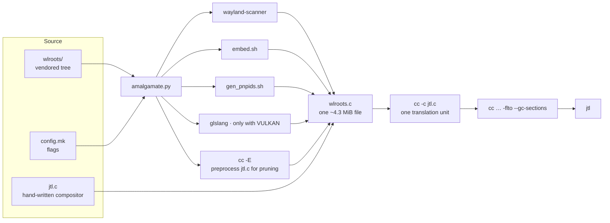

# jtl

> A super lightweight tiling Wayland compositor with just enough features to get you up and running — with **all of wlroots inlined into a single C file.**

  

jtl is a dwl-style dynamic tiling compositor for Wayland. It speaks to the kernel through a *vendored copy of the entire wlroots tree* compiled together with the compositor into **one translation unit** — no shared library, no meson, no ninja. `jtl.c` is a hand-written ~3,400-line compositor; `wlroots.c` is a ~4.3 MiB generated file that contains every wlroots source, public header, protocol binding and shader you need. `jtl.c` simply does:

```c
#include "wlroots.c"
```

That's the whole trick, and the whole point of this project.

---

## Table of contents

1. [Why does this exist?](#why-does-this-exist)
2. [Features](#features)
3. [How it works](#how-it-works)
4. [Project layout](#project-layout)
5. [Feature toggles](#feature-toggles)
6. [Requirements](#requirements)
7. [Building and installing](#building-and-installing)
8. [Configuration](#configuration)
9. [Key bindings](#key-bindings)
10. [Running](#running)
11. [Under the hood](#under-the-hood)
12. [FAQ](#faq)
13. [License](#license)

---

## Why does this exist?

Most compositors split into two moving parts: **wlroots** (the Wayland backends, renderers, and low-level protocol machinery — usually built with meson/ninja as a shared library) and **the compositor** that links against it (like dwl, sway, etc.).

jtl collapses both into one. The vendored `wlroots/` tree is *never compiled as a library*. Instead, a Python script — `amalgamate.py` — reads the tree and prints out a single `wlroots.c` file with all the code inline. The benefits:

- **One file, one build command.** Everything downstream of a clang/`cc` `-c` is the entire compositor *and* wlroots. No separate library build, no pkg-config dependency on a system wlroots, no version skew between "wlroots on my machine" and "wlroots the compositor was written against".
- **Whole-program visibility.** Because everything is one translation unit, the compiler and linker see *all* of wlroots at once — `-flto`, `-ffunction-sections` and `--gc-sections` can then discard wlroots code jtl never calls, and `-Werror=*` type checks validate definitions across the whole amalgamation, not file-by-file.
- **Toggleable features without touching C.** Features live behind flags in `config.mk`; toggling one re-runs the generator and re-pulls exactly the right wlroots sources.
- **Committed, buildable source.** `wlroots.c` is meant to live in the repo. Once `wlroots/` is deleted, a fresh clone builds with just `make`.

The trade-off is honest: a 4.3 MiB translation unit is slower to compile than a modular build, and reorganizing wlroots' C files isn't possible without regenerating. For a personal compositor this is a very good trade.

---

## Features

- **Dynamic tiling** with a master/stack layout — resize the master area, change the number of master windows, and `zoom` a window into the master slot.
- **Tags (workspaces)** — 9 by default (`Mod+1..9`), each monitor carries an independent tag set, and `Mod+Tab` toggles between your last two views.
- **Multiple monitors** — per-monitor layout rules, focus/move between monitors, auto-arranged layout with manual placement support.
- **Floating and fullscreen** windows, with per-client *tearing* control (`Mod+O`/`Mod+P`) for gaming.
- **Window animations** — ease-out-cubic box + fade on map, configurable duration and starting opacity.
- **Gaps** — configurable outer and inner gaps.
- **Layer shell** — bars, notifications and overlays (compatible with waybar, nwg-bar, etc.).
- **XDG decoration** including the deprecated server-decoration protocol for older clients.
- **Cursor shapes, pointer constraints** and keyboard-led pointer control.
- **Window autostart** — launch a list of apps once the compositor starts.
- **Protocols exposed** — `xdg-shell`, `layer-shell`, `xdg-decoration`, `cursor-shape-v1`, `pointer-constraints-unstable-v1`, `presentation-time`, `viewporter`, `subcompositor`, primary selection, `wlr-data-control` + `ext-data-control`, `wlr-screencopy`, `wlr-output-management` + `wlr-xdg-output`, `wlr-foreign-toplevel-management`, `ext-workspace-v1`, and XWayland. (The amalgamation generates *every* protocol wlroots ships, so more are available on demand.)

The following are **optional** and compiled in/out from `config.mk`:

| Flag | Adds |
|---|---|
| `XWAYLAND` | Run X11 applications (XWayland, e.g. games that won't go native Wayland) |
| `FULLSCREEN_TEARING` | Allow fullscreen tearing + `Mod+O`/`Mod+P` to toggle it per-client |
| `FOREIGN_TOPLEVEL` | `ext-foreign-toplevel-list-v1` for waybar, nwg-bar, etc. |
| `WORKSPACES` | `ext-workspace-v1` (used by the jtlab tray workspace popup) |
| `X11_BACKEND` | Compile the **X11 backend** into wlroots (run a full X server as a "monitor") |
| `VULKAN` | Compile the **Vulkan renderer** into wlroots (`WLR_RENDERER=vulkan`) |

See [Feature toggles](#feature-toggles) for how these differ from each other.

---

## How it works



`make` does all of this for you. The interesting bits, in order:

1. **Read the flags** from `config.mk`. Every `-D...` on an uncommented line is picked up (see [Feature toggles](#feature-toggles)).
2. **Generate support code** — this is code generation, *not* compilation:
   - `wayland-scanner` turns the ~13 vendored wlroots protocols + `wayland-protocols` XMLs into `.c`/`.h` binding code (`build/protocol/`);
   - `wlroots/render/gles2/shaders/embed.sh` turns the GLSL shaders into C headers;
   - `wlroots/backend/drm/gen_pnpids.sh` builds the PCI vendor-id table from `hwdata`'s `pnp.ids`;
   - `glslang` compiles the Vulkan SPIR-V shaders — only when `VULKAN` is enabled.
3. **Write the feature config headers** — `wlr/config.h` (the `WLR_HAS_*` macros), `wlr/version.h`, and wlroots' internal `config.h`, all matching the enabled feature set.
4. **Choose the candidate sources** — every wlroots source, plus the feature-gated ones (`xwayland/…`, `backend/x11/…`, `render/vulkan/…`) if their flag is on.
5. **Prune** — the script preprocesses `jtl.c` (with the `config.mk` flags applied) to find the wlroots symbols jtl actually touches, then walks the call-graph through all candidate sources, keeping only the reachable ones. Dead wlroots files never make it into `wlroots.c` in the first place.
6. **Inline headers** — remaining headers are collected in dependency order and `#include`s *within* `wlroots/` and `build/` are replaced by their contents. System includes (`<wayland-server-core.h>`, `<vulkan/vulkan.h>`, …) stay as real `#include` lines.
7. **De-collide symbols** — since every file now lives in *one translation unit*, file-local `static` symbols would clash. Each file's statics get a unique prefix derived from its path (e.g. `WLR_BACKEND_DRM_ATOMIC_C_...`), while all non-static wlroots symbols keep their real names so `jtl.c` (and anything inside `wlroots.c`) can call them without change. Struct/enum tags that would collide are renamed too.
8. **Emit `wlroots.c`** — a preamble with the feature macros and `#pragma` warning suppression for the third-party code, then headers, generated protocol code, and sources in order, each in a labelled block like:

```c
/* ===== source: backend/wayland/output.c ===== */
```

And `jtl.c` begins with `#include "wlroots.c"`, so when `jtl.c` is compiled the whole system is compiled. `--gc-sections` at link time then drops whatever the compiler kept but jtl never calls.

---

## Project layout

| Path | Purpose |
|---|---|
| `jtl.c` | The compositor — hand-written, ~3,400 lines. **This is the file you edit.** Its first line is `#include "wlroots.c"`. |
| `wlroots.c` | **Generated.** All wlroots code inlined into one file (committed to the repo — see [FAQ](#faq)). |
| `amalgamate.py` | The generator. Reads `wlroots/` + `config.mk`, writes `wlroots.c`. Pure codegen — no meson/ninja. |
| `scan.py` | Helper imported by `amalgamate.py` (identifies file-local statics, struct tags, C keywords). |
| `wlroots/` | The vendored wlroots 0.21 tree. Only needed **while regenerating**; safe to delete afterwards. |
| `build/` | Generated support files — config headers, protocol bindings, shader headers, `pnpids.c`. |
| `config.mk` | **Build flags & feature toggles** (used by both `make` and `amalgamate.py`). |
| `config.def.h` / `config.h` | Runtime behaviour — colors, monitor rules, window rules, key bindings. |
| `protocols/` | Extra protocol XMLs used in earlier builds. |
| `jtl.desktop` | Wayland session entry (`/usr/share/wayland-sessions/jtl.desktop`). |

---

## Feature toggles

There are two *different kinds* of feature flags in `config.mk`, and it's worth knowing which is which:

### 1. `#ifdef` flags — things jtl itself does

```make
XWAYLAND = -DXWAYLAND
FULLSCREEN_TEARING = -DFULLSCREEN_TEARING
FOREIGN_TOPLEVEL = -DFOREIGN_TOPLEVEL
WORKSPACES = -DWORKSPACES
```

These are passed to the **C compiler** and switch `#ifdef` blocks inside `jtl.c` (foreign-toplevel handles, workspace groups, tearing keybindings, XWayland glue). They only affect jtl's own code — toggling one is a recompile of `jtl.c` and nothing else.

### 2. Wlroots feature flags — things wlroots compiles in

```make
#X11_BACKEND = -DX11_BACKEND      # X11 backend  (all deps already in PKGS)
#VULKAN     = -DVULKAN            # Vulkan renderer
#VULKAN_LIBS = vulkan             # …and link the loader
```

These define what **goes into `wlroots.c`**. Because `config.mk` is a prerequisite of `wlroots.c`, toggling one makes the next `make` re-run `amalgamate.py` — pulling in the matching wlroots sources and flipping the `WLR_HAS_X11_BACKEND` / `WLR_HAS_VULKAN_RENDERER` macros in the generated `wlr/config.h` — and then recompiles everything. wlroots' own dispatch code (`wlr_backend_autocreate`, `wlr_renderer_autocreate`, …) is already guarded with those macros, so the feature becomes available or disappears *automatically*, with no changes to `jtl.c`.

> **Note:** the X11 flag is named `X11_BACKEND`, not `X11` — jtl.c has `enum { XDGShell, LayerShell, X11 }`, and `-DX11` would collide with that identifier.

---
**The rules of thumb:**

- Comment/uncomment a jtl flag → just recompile.
- Comment/uncomment a wlroots flag → regenerate + recompile (automatic).
- Both happen while `wlroots/` is still present. After it's deleted, `wlroots.c` is frozen and toggling isn't possible (see [FAQ](#faq)).

---

## Requirements

For **building** (both codegen and compile):

| Package | Needed for |
|---|---|
| `wayland-protocols`, `wayland-scanner` | generating the protocol bindings |
| `hwdata` | the PCI vendor id table (`pnp.ids`) for the DRM backend |
| `glslang` | **only** if `VULKAN` is enabled (SPIR-V shaders) |

For **linking** (the full `PKGS` list in the Makefile):

```
wayland-server  xkbcommon  libinput  pixman-1  libdrm  egl  gbm  glesv2
lcms2  libudev  libseat  libdisplay-info  libliftoff  wayland-client
xcb  xcb-dri3  xcb-present  xcb-render  xcb-renderutil  xcb-shm
xcb-xfixes  xcb-xinput  xcb-composite  xcb-ewmh  xcb-icccm  xcb-res  xcb-shape
```

plus `vulkan` (loader) if `VULKAN` is enabled. The xcb stack is required *unconditionally* because the XWayland code is always amalgamated in; `-Wl,--as-needed` takes care of dropping libs no backend actually uses at runtime.

There is **no** dependency on a system wlroots — ever.

---

## Building and installing

```sh
make           # generate wlroots.c if needed, then compile
sudo make install
```

To force a regeneration: `make amalgamate` (only while `wlroots/` exists).

```sh
make clean     # removes jtl and *.o — wlroots.c and build/ are kept
```

### A quick tour of the build

1. `amalgamate.py` regenerates `wlroots.c` from `wlroots/` + `config.mk` whenever `jtl.c`, `config.mk`, or the scripts changed.
2. `cc -c jtl.c` compiles the entire compositor **and** wlroots as one translation unit (flags: `-O2 -march=native -flto -ffunction-sections -fdata-sections`, strict cross-file warning checks, with the noisy wlroots-specific warnings suppressed via `#pragma` around the amalgamated section).
3. The link drops unused sections with `-Wl,--gc-sections` and unused libraries with `-Wl,--as-needed`.

The point is there's no wlroots buildsystem anywhere in the chain: no meson, no ninja, no `wlroots.pc`.

---

## Configuration

### `config.h` (from `config.def.h`) — how the compositor behaves

Copied to `config.h` at first build (`cp config.def.h config.h`). Notable knobs:

| Section | What you can set |
|---|---|
| Appearance | `borderpx`, root/border/focus colors (ARGB via `COLOR(0xAARRGGBB)`) |
| Tags | `TAGCOUNT` (1–31, default 9) |
| **Monitor rules** | Match a monitor by name substring → `mfact`, `nmaster`, `scale` (HiDPI), `transform` (rotation), layout `x`/`y` (`-1,-1` = auto-arrange) |
| **Window rules** | POSIX regex on `app-id` (or X11 `WM_CLASS`) and title → workspace bitmask, open fullscreen |
| Gaps | outer/inner gaps in pixels |
| Animations | duration in ms (`0` disables) and starting opacity |
| Keyboard | key repeat rate/delay |
| Key bindings | the whole `keys[]` table (see below) |

> **Don't forget:** set which display output you're using in `config.h`'s `monrules[]` — a rule with `scale`/`transform`/position only applies to matching monitor names.

### `config.mk` — how it builds and what features are compiled

As described in [Feature toggles](#feature-toggles) — plus the CFLAGS/LDFLAGS. The flags are the classic dwl set, which are *especially* relevant to an amalgamated build:

- `-ffunction-sections -fdata-sections` + `-Wl,--gc-sections` → the linker discards every wlroots function/data object jtl doesn't use;
- `-flto` → whole-program optimization across the single TU;
- `-Wl,--as-needed` → only actually-used libs are kept at runtime;
- `-Werror=*` type/return checks → cross-file checking across the whole amalgamation in one pass.

If you hit build-time or memory pressure from `-flto` on the big TU, dropping `-flto` is a one-line change and doesn't affect correctness.

---

## Key bindings

Modifier = **Super** (the logo key).

| Keys | Action |
|---|---|
| `Mod+q` | Launch terminal (`footclient`) |
| `Mod+a` | Launch menu (`jtlabctl menu`) |
| `Mod+e` | Launch file manager (`nemo`) |
| `Mod+b` | Launch startup services |
| `Mod+j` / `Mod+k` | Focus next / previous window |
| `Mod+i` / `Mod+d` | More / fewer master windows |
| `Mod+h` / `Mod+l` | Shrink / grow the master area |
| `Mod+Return` | Zoom focused window to master |
| `Mod+Tab` | Toggle between the last two views |
| `Mod+y` | Toggle fullscreen |
| `Mod+o` / `Mod+p` | Enable / disable fullscreen tearing *(`FULLSCREEN_TEARING`)* |
| `Mod+Shift+q` | Close focused window |
| `Mod+,` / `Mod+.` | Focus monitor up / down |
| `Mod+Shift+<` / `>` | Move window to other monitor |
| `Mod+1` … `Mod+9` | Switch to tag 1–9 |
| `Mod+Shift+1` … `Mod+Shift+9` | Move focused window to that tag |
| `Mod+Shift+p` | Quit jtl |
| `Ctrl+Alt+Backspace` | Quit (also) |
| `Ctrl+Alt+F1` … `F12` | Switch virtual terminal |

---

## Running

1. Make sure `XDG_RUNTIME_DIR` is set (your login manager does this).
2. Pick a session. Either select the `jtl.desktop` entry in your display manager, or start it yourself:

```sh
XDG_RUNTIME_DIR=/run/user/$(id -u) ./jtl
```

3. As usual, the standard wlroots knobs work:

```sh
WLR_BACKENDS="drm,libinput"     # default: autocreate on the first seat/DRM
WLR_BACKENDS="x11"              # if you compiled the X11 backend in
WLR_RENDERER="vulkan"           # if you compiled the Vulkan renderer in
run() { exec env WLR_BACKENDS="$1" WLR_RENDERER="$2" ./jtl; }
```

The renderer/backend choice is made by `wlr_backend_autocreate` / `wlr_renderer_autocreate` inside the amalgamated wlroots — so a compiled-in X11 or Vulkan feature is selected purely at runtime via these environment variables.

---

## Under the hood

### Pruning, in one paragraph

`amalgamate.py` preprocesses `jtl.c` (with your `config.mk` flags) and collects every identifier it references. Those are the *seeds*. It then loads every candidate wlroots source, records what each one defines and references, and computes the transitive closure from the seeds through the symbol graph. Any file outside the closure is dropped. Two levels of dead-code elimination then remain: `--gc-sections` at the *function* level, and `-flto` at the *whole-program* level.

### Why the generated statics are renamed

In a normal build each `.c` file is its own translation unit, so two files can both have a `static` helper called `apply_config` without conflict. In an amalgamation they'd collide. `amalgamate.py` therefore renames each file's `static` symbols with a path-derived prefix (`static void WLR_BACKEND_WAYLAND_OUTPUT_C_...`) and renames clashing `struct`/`enum` tags, while leaving every public wlroots API untouched — so `jtl.c` calls `wlr_scene_create(...)` exactly as if it linked the real library.

### Warning hygiene

`jtl.c` is compiled with a strict, dwl-flavoured warning set (`-Wpedantic -Wshadow -Werror=strict-prototypes …`). wlroots and its generated code aren't written to that bar, so the generated file surrounds the inlined section with `#pragma GCC diagnostic push/ignored/…/pop` for the noisy groups. Your code in `jtl.c` still gets the full strict treatment; wlroots just doesn't break the build.

---

## FAQ

**Can I delete the `wlroots/` directory?**
Yes. Once `wlroots.c` exists you never need it again — `make` detects the missing tree, keeps the existing `wlroots.c`, and just compiles. Only regenerate `wlroots.c` *before* deleting it; afterwards your feature set is frozen (which is also why `wlroots.c` is committed).

**Why is `wlroots.c` committed?**
Because the project is meant to be *fully buildable* from a fresh clone with zero wlroots. Committing the generated file is what removes the `wlroots/` tree from the build path entirely. It's big, but it's exactly what you'd otherwise build.

**Why not compile wlroots as a library?**
A library means a second buildsystem (meson), a dependency on a system wlroots version, and a link boundary that prevents whole-program optimization. Inlining it gives one build command and lets `-flto`/`--gc-sections` do their thing across the whole system.

**Does `make clean` wipe the wlroots code?**
No. `clean` only removes `jtl` and `*.o`. `wlroots.c` and `build/` are persistent, so the next build is just a recompile.

**I want to toggle a feature.**
Edit `config.mk` and run `make`. If it's a jtl flag (XWayland, tearing, foreign toplevel, workspaces) it's a recompile; if it's a wlroots flag (`X11_BACKEND`, `VULKAN`) the generator re-runs automatically. Do it while `wlroots/` still exists.

**Do I need to add `#include <wlr/...>` to `jtl.c` when trying new wlroots APIs?**
No. Every wlroots header is already inlined into `wlroots.c`; the include file is generated from the tree, so to use a new API you restore `wlroots/`, (optionally) toggle the feature, and run `make amalgamate`.

**The build is slow / uses a lot of memory.**
That's the trade-off of a single TU. First thing to try: drop `-flto` in `config.mk` (`CFLAGS`/`LDFLAGS`). It's a plain performance-vs-build-time knob.

---

## License

MIT — © 2026 Kearan Lynch. See [LICENSE](LICENSE).

*wlroots is distributed under its own MIT license in the vendored `wlroots/` tree.*